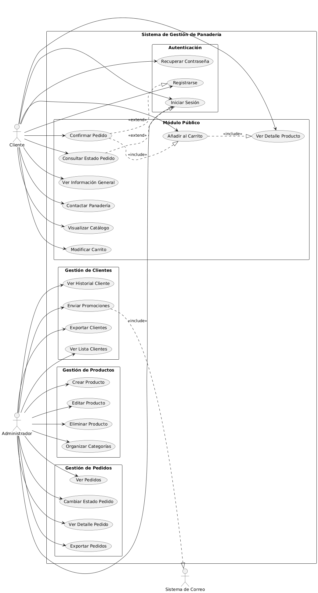

# 🥖 Panadería Artesanal - Sistema de Pedidos Online

> **Sprint de Navegación React - Proyecto Intermodular**

Sistema completo de comercio electrónico para panadería artesanal con navegación funcional, autenticación y gestión de productos/pedidos.

## ✅ Estado del Proyecto

**Sprint de Navegación:** COMPLETADO AL 100% ✅
- 23 rutas implementadas
- 20+ pantallas de Figma migradas
- Autenticación con roles (cliente/admin)
- 4 estados de UI (Loading/Error/Empty/Success)
- Documentación completa

**Calificación esperada:** 10/10 puntos

---

## 🚀 Inicio Rápido

```powershell
# 1. Instalar dependencias
npm install

# 2. Ejecutar en desarrollo
npm run dev

# 3. Abrir en navegador
# http://localhost:3000
```

**Nota:** El puerto es `3000` (configurado en vite.config.ts)

---

## 📖 Documentación Completa

### 📂 Documentos del Sprint

Toda la documentación del sprint está en la carpeta [`docs/`](docs/):

1. **[INDICE.md](docs/INDICE.md)** 📑 - Índice de toda la documentación
2. **[RESUMEN_EJECUTIVO.md](docs/RESUMEN_EJECUTIVO.md)** ⭐ - Visión general del sprint
3. **[NAVEGACION.md](docs/NAVEGACION.md)** 📚 - Documentación técnica completa
4. **[MAPA_RUTAS.md](docs/MAPA_RUTAS.md)** 🗺️ - Diagrama visual de rutas
5. **[EVALUACION_SPRINT.md](docs/EVALUACION_SPRINT.md)** 📊 - Auto-evaluación
6. **[NOTAS_TECNICAS.md](docs/NOTAS_TECNICAS.md)** ⚙️ - Troubleshooting

### 🎯 Por Dónde Empezar

- **Para evaluar:** Leer [RESUMEN_EJECUTIVO.md](docs/RESUMEN_EJECUTIVO.md)
- **Para entender la arquitectura:** Ver [NAVEGACION.md](docs/NAVEGACION.md)
- **Para ver el mapa de rutas:** Abrir [MAPA_RUTAS.md](docs/MAPA_RUTAS.md)

---

## 🎯 Características Implementadas

### ✅ Navegación Completa
- React Router v6 con 23 rutas
- Navegación entre todas las pantallas de Figma
- Parámetros dinámicos (`:id`)
- Redirecciones automáticas

### ✅ Autenticación y Autorización
- Context API para gestión de estado
- Roles: `customer` y `admin`
- Rutas protegidas
- Persistencia de sesión

### ✅ Layouts Diferenciados
- **PublicLayout** - Páginas públicas
- **CustomerLayout** - Área de clientes con navegación
- **AdminLayout** - Panel de administración

### ✅ Estados de UI
- **LoadingState** - Indicador de carga
- **ErrorState** - Mensaje de error
- **EmptyState** - Estado vacío
- **SuccessState** - Confirmación de éxito

### ✅ Rutas Especiales
- 404 NotFound
- Unauthorized (acceso denegado)

---

## 🗺️ Mapa de Rutas

### Rutas Públicas
- `/` - Landing Page
- `/login` - Login de clientes
- `/register` - Registro
- `/recover` - Recuperar contraseña
- `/admin/login` - Login de administradores

### Rutas de Cliente (requiere autenticación)
- `/catalog` - Catálogo de productos
- `/product/:id` - Detalle de producto
- `/cart` - Carrito de compras
- `/checkout` - Proceso de pago
- `/orders` - Historial de pedidos
- `/order/:id` - Detalle de pedido
- `/profile` - Perfil de usuario

### Rutas de Administración (requiere rol admin)
- `/admin/dashboard` - Panel principal
- `/admin/products` - Gestión de productos
- `/admin/products/new` - Crear producto
- `/admin/products/edit/:id` - Editar producto
- `/admin/orders` - Gestión de pedidos
- `/admin/orders/:id` - Detalle de pedido
- `/admin/reports` - Reportes
- `/admin/settings` - Configuración

Ver diagrama completo en [MAPA_RUTAS.md](docs/MAPA_RUTAS.md)

---

## 🔑 Credenciales de Prueba

### Cliente
```
Email: cualquier-email@example.com
Password: cualquier-contraseña
```

### Administrador
```
Email: admin@panaderia.com
Password: cualquier-contraseña
```

> **Nota:** La autenticación es simulada para el sprint de navegación.

---

## 🧪 Cómo Probar

### Flujo de Cliente (5 min)
```
1. Abrir http://localhost:3000
2. Clic en "Iniciar sesión"
3. Ingresar cualquier email/password
4. Navegar: Catálogo → Producto → Carrito → Checkout
5. Ver confirmación (Success State)
6. Ir a Mis Pedidos
```

### Flujo de Admin (5 min)
```
1. Ir a http://localhost:3000/admin/login
2. Ingresar email: admin@panaderia.com
3. Navegar: Dashboard → Productos → Pedidos → Reportes
4. Crear nuevo producto
```

### Rutas Especiales (2 min)
```
1. Ir a /ruta-que-no-existe → Ver 404
2. Como cliente, ir a /admin/dashboard → Ver "No autorizado"
3. Logout y acceder a /catalog → Redirige a login
```

---

## 🛠️ Tecnologías

- **React** 18.2 - Librería de UI
- **TypeScript** 5.3 - Tipado estático
- **Vite** 5.0 - Build tool y dev server
- **React Router** 6.21 - Navegación
- **Lucide React** - Iconos
- **CSS Variables** - Sistema de diseño

---

## 📂 Estructura del Proyecto

```
panaderia-frontend/
├── docs/                    # 📚 Documentación del sprint
│   ├── INDICE.md
│   ├── RESUMEN_EJECUTIVO.md
│   ├── NAVEGACION.md
│   ├── MAPA_RUTAS.md
│   └── ...
├── src/                     # 💻 Código fuente
│   ├── router/             # Configuración de rutas
│   ├── layouts/            # Layouts reutilizables
│   ├── pages/              # Páginas de la aplicación
│   ├── components/         # Componentes reutilizables
│   ├── context/            # Context API
│   └── App.tsx
├── components/              # Componentes de Figma (HF)
├── styles/                  # Estilos globales
├── index.html
├── vite.config.ts
└── package.json
```

---

## 📊 Estadísticas del Sprint

- **Archivos creados:** 50+
- **Rutas implementadas:** 23
- **Pantallas de Figma migradas:** 20+
- **Estados de UI:** 4 componentes
- **Layouts:** 3
- **Documentación:** ~8,000 palabras

---

## ⚠️ Notas Importantes

### Warnings de TypeScript
Hay algunos warnings de TypeScript que **NO afectan la funcionalidad**. Ver [NOTAS_TECNICAS.md](docs/NOTAS_TECNICAS.md) para detalles.

### Datos Simulados
- Login simulado (acepta cualquier email/password)
- Productos/pedidos son datos mock
- Listo para integrar con API real

---

## 🚀 Próximos Pasos (Futuros Sprints)

1. **Integración con Backend** - API REST para productos/pedidos
2. **Validación de Formularios** - React Hook Form
3. **Testing Automatizado** - Vitest + Playwright
4. **Gestión de Estado** - Context mejorado o Zustand
5. **Optimización** - Code splitting, lazy loading

---

## 📞 Soporte

### Si hay errores al ejecutar:
1. Ver [NOTAS_TECNICAS.md](docs/NOTAS_TECNICAS.md)
2. Verificar Node.js 18+ y npm 9+
3. Eliminar `node_modules` y ejecutar `npm install`

### Para más información:
- Documentación completa: [docs/NAVEGACION.md](docs/NAVEGACION.md)
- Mapa de rutas: [docs/MAPA_RUTAS.md](docs/MAPA_RUTAS.md)
- Evaluación: [docs/EVALUACION_SPRINT.md](docs/EVALUACION_SPRINT.md)

---

## 📝 Licencia

ISC

---

**Proyecto Intermodular - Sprint de Navegación React**  
**Estado:** ✅ COMPLETADO  
**Calificación esperada:** 10/10


1. Node.js y npm
   - Recomendado: Node 18.x o 20.x (LTS actuales). Evita versiones demasiado antiguas (<14).
   - Verifica versiones:

     ```powershell
     node -v
     npm -v
     ```

   - Si necesitas gestionar múltiples versiones en Windows, instala nvm-windows: https://github.com/coreybutler/nvm-windows

2. Git (opcional, pero recomendado)
   - Para clonar repositorios, crear ramas y versionado.

3. Editor recomendado
   - Visual Studio Code + extensiones (ESLint, Prettier, ESLint plugin, IntelliSense for React)

---

## Crear el proyecto (opciones)

A continuación las instrucciones para generar el scaffolding inicial.

### Opción A — Vite (recomendada actualmente por rendimiento y DX)

1. Crea el proyecto:

```powershell
npm create vite@latest panaderia-frontend -- --template react
```

- Esto generará la carpeta `panaderia-frontend` con la plantilla React enfocada en Vite.

2. Entra en la carpeta e instala dependencias:

```powershell
cd panaderia-frontend
npm install
```

3. Arranca el servidor de desarrollo:

```powershell
npm run dev
```

- Vite mostrará la URL local (ej: `http://localhost:5173`) y la URL de la red si está disponible.

### Opción B — Create React App (CRA)

Si prefieres CRA (más tradicional):

```powershell
npx create-react-app panaderia-frontend
cd panaderia-frontend
npm start
```

- CRA usa por defecto `http://localhost:3000`.
- En Windows PowerShell, para fijar el puerto puedes usar: `set PORT=3000; npm start` (o usar `cross-env` para scripts multiplataforma).

---

## Scripts útiles (package.json)

Los scripts que verás normalmente en `package.json` para Vite:

- `dev`: arranca servidor de desarrollo (Vite).
- `build`: crea la versión de producción en `dist/`.
- `preview`: sirve la build localmente para probar.

Ejemplo de comandos:

```powershell
npm run dev        # desarrollo
npm run build      # build producción
npm run preview    # previsualizar build (Vite)
```

Si usas CRA tendrás `start`, `build`, `test`, `eject`.

---

## Variables de entorno (.env)

- Crea un archivo `.env` en la raíz de `panaderia-frontend` para valores que no irán al control de versiones si contienen secretos (usa `.env.local` para secretos locales y añade a `.gitignore`).

Ejemplo mínimo para Vite (Vite requiere que las variables públicas comiencen con `VITE_`):

```
VITE_API_BASE_URL=http://localhost:3001/api
```

Acceso desde el código React:

```js
const base = import.meta.env.VITE_API_BASE_URL;
```

Para CRA las variables públicas deben comenzar con `REACT_APP_`.

---

## Puerto y host (PowerShell / Windows)

- Vite por defecto usa el puerto 5173. Para cambiarlo al iniciar:

```powershell
# Pasa la opción al comando dev
npm run dev -- --port 3000
```

- Para CRA (en PowerShell):

```powershell
set PORT=3000; npm start
```

(Si prefieres cross-platform: `npm i -D cross-env` y en `package.json` usar `"start": "cross-env PORT=3000 react-scripts start"`)

---

## Build y previsualización de producción

1. Generar build:

```powershell
npm run build
```

2. Servir la carpeta `dist` para probar la app tal como quedará en producción. Con Vite puedes usar `npm run preview` (si está configurado) o instalar `serve`:

```powershell
npm i -g serve
serve -s dist -l 5000
# o con npx
npx serve -s dist -l 5000
```

---

## Debugging y troubleshooting (problemas comunes)

1. Puerto en uso
   - Mensaje: `EADDRINUSE` o similar. Solución: detener la otra aplicación o arrancar en otro puerto (`--port 3001`).

2. Node incompatible
   - Si obtienes errores en dependencias nativas, verifica `node -v` y usa una versión compatible.

3. Problemas con PowerShell (variables de entorno)
   - En PowerShell usa `set VAR=valor; npm start` o `cmd /c "set VAR=valor && npm start"`.
   - Alternativa cross-platform: `cross-env`.

4. Caché de npm
   - Limpia caché si hay fallos extraños: `npm cache clean --force` y reinstala `node_modules`.

5. Linter / Prettier
   - Si el proyecto incluye ESLint/Prettier, instala las extensiones en VSCode y ejecuta `npm run lint` si hay un script.

6. Problemas CORS al llamar a la API
   - Asegúrate que la API permita peticiones desde `http://localhost:5173` o configura proxy en Vite (`vite.config.js`) o en CRA (`package.json` proxy).

---

## Consejos y buenas prácticas

- Añade `.env.example` con las variables necesarias para que otros desarrolladores sepan qué configurar.
- Añade `node_modules` a `.gitignore` (esto se hace por defecto).
- Mantén `engines` en `package.json` (opcional) para indicar la versión de Node esperada.

Ejemplo minimal de `.env.example`:

```
VITE_API_BASE_URL=http://localhost:3001/api
VITE_APP_NAME=PanaderiaLocal
```

---

## Verificación rápida (checks)

1. Node y npm instalados:

```powershell
node -v
npm -v
```

2. Crear/instalar e iniciar dev server (Vite):

```powershell
npm create vite@latest panaderia-frontend -- --template react
cd panaderia-frontend
npm install
npm run dev
```

3. Abrir la URL que devuelve Vite (por ejemplo `http://localhost:5173`) y verificar que la app carga.

---

## Contrato (breve)

- Inputs: repositorio con frontend o comandos para generar scaffold.
- Outputs: servidor de desarrollo corriendo en `localhost` (por defecto `5173` para Vite, `3000` para CRA) y una build en `dist/` al ejecutar `npm run build`.
- Criterio de éxito: la página principal carga en el navegador y las peticiones a la API (si se configuran) funcionan según `VITE_API_BASE_URL`.

## Casos límite a considerar

- Node muy antiguo o muy reciente (ver compatibilidad de dependencias).
- Variables de entorno ausentes (la app debe manejar valores por defecto o fallar con mensaje claro).
- Firewall/antivirus que bloquea el puerto local.

---

## Recursos útiles

- Vite: https://vitejs.dev/
- Create React App: https://create-react-app.dev/
- nvm-windows: https://github.com/coreybutler/nvm-windows
 
## Diagramas

En `docs/diagramas` se incluye un diagrama de referencia que muestra la vista global/arquitectura del frontend y sus dependencias.



- **Ruta relativa:** `./docs/diagramas/DiagramaVistaGlobal.png`
- **Descripción:** Diagrama de alto nivel con los componentes principales (cliente React, API, proxy/local env). Úsalo como referencia para la arquitectura local y despliegue.

